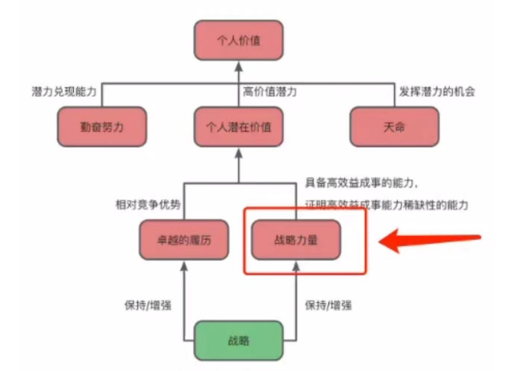

## 问题

学历，出身不好的人，做一些有体现成效的工作，软件工程师来说，如何体现工作成效
换公司，如何体现水平

很多人懂得很多，但是没什么写在简历上，应该怎么办？

## 一名工程师的工作成果，以证明胜任某项工作

- 在大厂经历过，参与过大厂的项目（以外包的角色去做也算）
- 参与知名开源项
- 学习被认可的认证，没有认证成果的学习无法作为胜任力的证明
- 写书
- 专栏

## 为什么你会觉得一个人很专业（By in），像一个专家？

尤其是在一些培训，咨询类场景，“靠脸吃饭”，例如个人介绍、成果、长相、讲话方式等内容，如何证明你牛逼。

- 个人介绍中的成果：写书，大厂中的title，学校、过去的经历，知名开源的项目。
- 带团队的规模
- 负责的项目的技术难度
- 更大的平台

## 假如你做了一个项目？怎么把这个项目的经验与成果最大化的转化？

- 归档项目材料
- 提炼一些分享的内容，
- 脱敏后的文档

## 在工作中做的什么事情，可以向外体现自己的能力，和胜任力举证？

- 只是干活不能体现价值，而是发现有价值的能力的工具。
- 把业务代码写的又快又好，不会让你成为专家，也不会让你成为领队
- 

## 洞见

- 在网上学习，取得的知识往往不能证明你是专家，不一定辩得过（即使你是对的）
- 做一些自认为有价值，但是无法体现能力的事情
- 救火的人能体现价值，但防止起火的人没有体现价值
- 建模和代码设计不方便体现长期价值，而快速修复 BUG却能体现能力和价值
- 本质体现价值不方便的问题
  - 算法底层开发比代码整洁设计更方便
  - 书或者文章比谈话和个人理解更有价值

