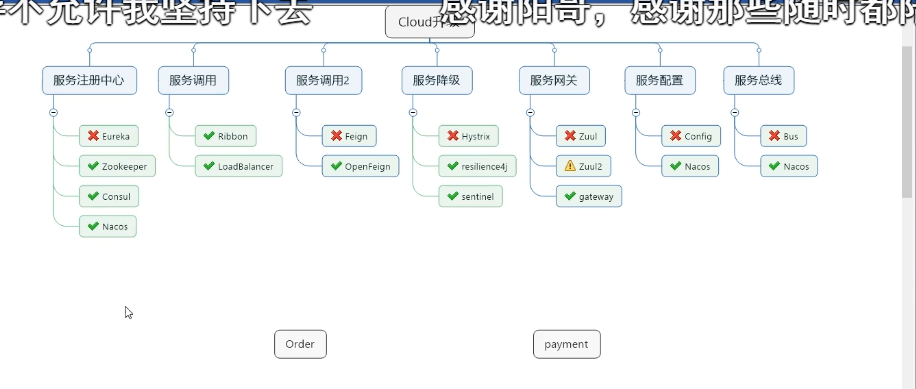

# 模块分层
native-java: 原生java相关：设计模式等。
spring-java: 基础Spring java项目: 一些spring java相关的实现。
这个项目是学习Spring Cloud时的实战项目

# 微服务模块
1. 建module
2. 改pom
3. 写yml
4. 主启动
5. 业务类

Cloud升级

## Spring eureka
服务注册与发现

* 心跳确认服务还活着
* 集群构建Eureka Server
### eureka两个组件
Server 提供服务注册
Client 注册中心访问 服务删除
### eureka集群

# P21
# 知识点
### 工程重构

### 热部署

### 抽取公共类

### 学习网址
https://github.com/paocaia/cloud2020
https://blog.csdn.net/qq_41211642/article/details/104772140
https://www.bilibili.com/video/BV18E411x7eT?p=14
### 抽取公共类
创建模块
mvn clean
mvn install
加上依赖

